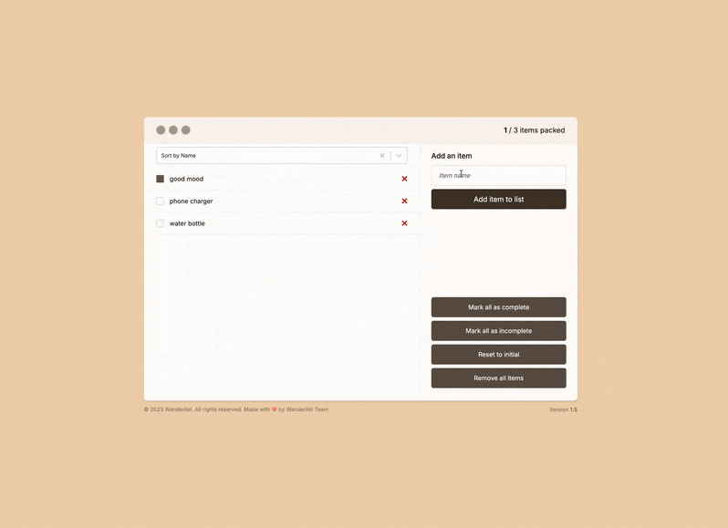

# WanderList

  &#160;
  &#160;
  &#160;
  

A modern React packing list application to help travelers organize their belongings, built with Vite and Zustand for state management.

## Features

- ✅ **Interactive Checklist:** Easily check off items as you pack them
- 🔄 **Sorting Options:** Sort your items by name, packed status, or unpacked items first
- 💾 **Persistent Storage:** Your packing list is saved locally and persists between sessions
- 🧹 **Bulk Actions:** Mark all items as complete/incomplete or clear your list with a single click
- 🔄 **Reset Functionality:** Reset to the initial items list whenever needed
- 📱 **Responsive Design:** Works seamlessly across desktop and mobile devices
- 🏗️ **Modern Architecture:** Built with Zustand for efficient state management
- 🎨 **Clean UI:** Intuitive and visually appealing interface

## Tech Stack

<table>
  <tr>
    <td width="100">
      <picture>
        
      </picture>
       React 19
    </td>
    <td width="100">
      <picture>
        
      </picture>
       JavaScript
    </td>
    <td width="100" align="center">
      <picture>
        
      </picture>
       Zustand
    </td>
  </tr>
  <tr>
    <td width="100">
      <picture>
        
      </picture>
       CSS
    </td>
    <td width="100">
      <picture>
        
      </picture>
       Vite
    </td>
    <td width="100">
      <picture>
        
      </picture>
       ESLint
    </td>
  </tr>
</table>

## Implementation Highlights

- **Optimized Rendering:** Uses `useMemo` for efficient list sorting
- **Custom Store:** Zustand store with persist middleware for local storage
- **Component Organization:** Clean separation of concerns between components
- **Responsive Design:** Works well on all device sizes
- **Modern React Patterns:** Uses the latest React best practices

## Getting Started

1. 📥 Clone the repository
2. 📦 Install dependencies: `npm install`
3. ▶️ Start the development server: `npm run dev`
4. 🌐 Open your browser to the local server address shown in terminal

## Usage

- Add new items using the form at the top
- Click checkboxes to mark items as packed
- Use the dropdown to sort your items
- Use the button group at the bottom for bulk actions

---

This project demonstrates proficiency in React, state management with Zustand, sorting algorithms, local storage persistence, and modern React development patterns.
